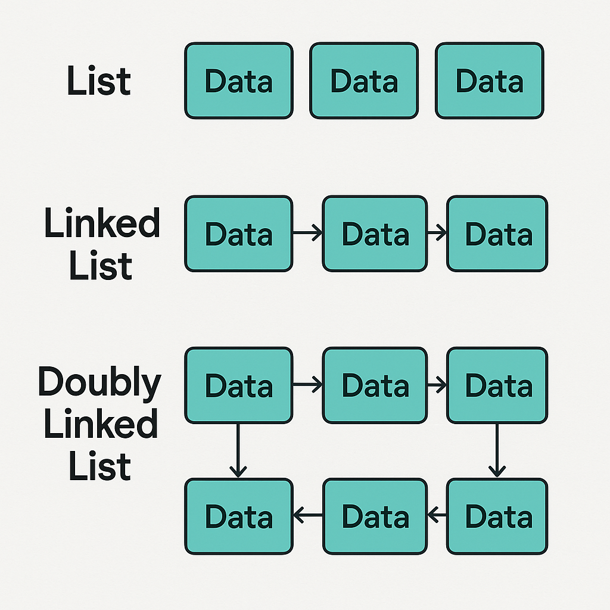

# Data Structures

## Overview

Data structures are essential components that help organize and store data efficiently in computer memory. They provide a way to manage and manipulate data effectively, enabling faster access, insertion, and deletion operations.

## What is a Data Structure?

_A data structure is a way of organizing and storing data_ in a computer so that it can be accessed and used efficiently. It defines the relationship between the data and the operations that can be performed on the data.

## Why are Data Structures Important?

Data structures are essential for the following reasons:

- **Efficient Data Management:** They enable efficient storage and retrieval of data, reducing processing time and improving performance.

- **Data Organization:** They organize data in a logical manner, making it easier to understand and access.

- **Data Abstraction:** They hide the implementation details of data storage, allowing programmers to focus on the logical aspects of data manipulation.

- **Reusability:** Common data structures can be reused in multiple applications, saving time and effort in development.

- **Algorithm Optimization:** The choice of the appropriate data structure can significantly impact the efficiency of algorithms that operate on the data.

## Classification of Data Structure

Data structures can be classified into two main categories:

- **Linear Data Structures:** These structures store data in a sequential order this allowing for easy **insertion** and **deletion** operations. Examples include arrays, linked lists, and queues.

- **Non-Linear Data Structures:** These structures store data in a hierarchical or interconnected manner this allowing for more complex relationships between data elements. Examples include trees, graphs, and hash tables.

## Types of Data Structures

Basically, data structures are divided into two categories:

### Linear Data Structures:

- **Array:** A collection of elements of the same type stored in contiguous memory locations.
- **Linked List:** A collection of elements linked together by pointers, allowing for dynamic insertion and deletion.
- **Queue:** A First-In-First-Out (FIFO) structure where elements are added at the end and removed from the beginning.
- **Stack:** A Last-In-First-Out (LIFO) structure where elements are added and removed from the top.

### Non-Linear Data Structures:

- **Tree:** A hierarchical structure where each node can have multiple child nodes.
- **Graph: A** collection of nodes connected by edges, representing relationships between data elements.
- **Hash Table:** A data structure that uses a hash function to map keys to values, allowing for fast lookup and insertion.

## Lists

### Array

An array is a collection of elements of the same type stored in contiguous memory locations. It allows for efficient access to elements using an index.

Arrays are fixed in size, meaning that once they are created, their size cannot be changed. They are useful for storing a collection of related data items, such as a list of numbers or a list of names.

### List

A list is a collection of elements that can be of different types. Lists are dynamic in size, meaning that they can grow or shrink as needed. They are useful for storing a collection of related data items, such as a list of names or a list of numbers.

### Linked List

A linked list is a collection of elements (nodes) where each node contains a data element and a reference (pointer) to the next node in the sequence. Linked lists allow for dynamic insertion and deletion of elements, making them more flexible than arrays.

### Double Linked List

A double linked list is a type of linked list where each node contains a reference to both the next and previous nodes in the sequence. This allows for more efficient traversal in both directions.
Double linked lists are useful for applications where bidirectional traversal is required, such as in a browser's history or a music playlist.

